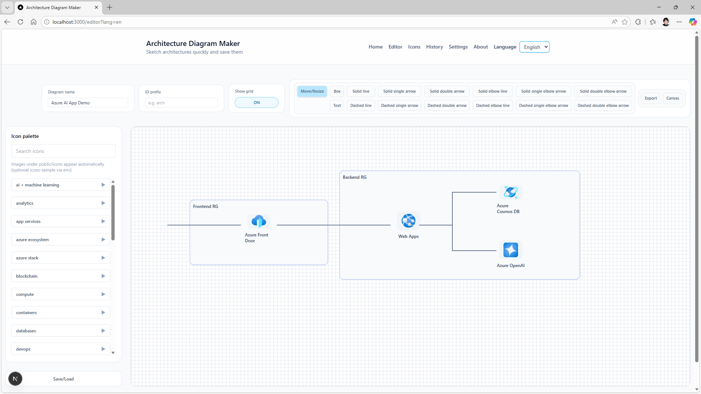

# Architecture Diagram Maker

[日本語](README.md) | English

[](LICENSE)
[](https://nodejs.org/)
[](https://nextjs.org/)
[](https://tailwindcss.com/)
[](https://learn.microsoft.com/entra/)

A lightweight editor for quickly drafting architecture diagrams and saving them as JSON. In addition to local storage, you can enable Azure Cosmos DB for cloud storage.



## Table of Contents

- [Key Features](#key-features)
- [Docs](#docs)
- [Quick Start](#quick-start)
- [Icons](#icons)
- [Environment Variables](#environment-variables)
- [Docker](#docker)
- [Azure Container Apps Deployment Overview](#azure-container-apps-deployment-overview)
- [Azure Cosmos DB Integration](#azure-cosmos-db-integration)
- [UI Defaults](#ui-defaults)
- [Localization](#localization)
- [Contributing](#contributing)
- [Code of Conduct](#code-of-conduct)
- [License](#license)

## Key Features

- Icon palette (auto-detect icons in the icons folder)
- Toggle sample icons via environment variable
- Boxes, text, arrows, and lines
- Z-order control plus duplicate/delete
- Save/load JSON in local storage
- Export to PNG / JSON
- Browse and search icons on the catalog page
- Auto-save history snapshots and restore
- Configure history retention and PNG export scale in settings
- Simple login screen when USER_NAME / USER_PASS are set
- Microsoft Entra ID (MSAL) authentication (optional)
- MSAL account information page (/account when MSAL is enabled)

## Docs

- [docs/architecture-en.md](docs/architecture-en.md): Architecture overview
- [docs/architecture-diagram-en.md](docs/architecture-diagram-en.md): Architecture diagram
- [docs/technology-en.md](docs/technology-en.md): Technology stack overview
- [docs/features-en.md](docs/features-en.md): Implemented features
- [docs/operations-en.md](docs/operations-en.md): Operations guide (detailed)

## Quick Start

### Prerequisites

- Node.js 20+
- npm

### Steps

1. Create the environment file.

```
cp .env.template .env
```

2. Install dependencies.

```
npm install
```

3. Start the development server.

```
npm run dev
```

Visit `http://localhost:3000/editor` to open the editor.

## Icons

- Place production icons under public/icons (nested folders supported).
  - Contents under public/icons are ignored by Git via .gitignore.
  - The folder structure is used as-is in the palette.
  - Example: download Azure service SVG icons from the [Azure Architecture Center](https://learn.microsoft.com/en-us/azure/architecture/icons/) and place the extracted folder under icons to use them.
- Sample icons live under public/icons-sample.
  - Control whether they appear in the palette via ICONS_SAMPLE_ENABLED.

## Environment Variables

- PORT: default 3000
- NODE_ENV: development / production
- COSMOS_ENDPOINT: Cosmos DB endpoint
- COSMOS_DATABASE: Cosmos DB database name
- COSMOS_CONTAINER: Cosmos DB container name
- NEXT_PUBLIC_HISTORY_LIMIT: history retention (10-1000)
- NEXT_PUBLIC_EXPORT_SCALE: PNG export scale (1-8)
- ICONS_SAMPLE_ENABLED: toggle sample icons
- USER_NAME: simple auth username
- USER_PASS: simple auth password
- NEXT_PUBLIC_AZURE_AD_CLIENT_ID: Entra ID app client ID
- NEXT_PUBLIC_AZURE_AD_TENANT_ID: Entra ID tenant ID
- NEXT_PUBLIC_AZURE_AD_REDIRECT_URI: MSAL redirect URI

When USER_NAME and USER_PASS are set, the `/login` screen is required and pages/APIs are blocked until authentication succeeds.
When NEXT_PUBLIC_AZURE_AD_* is configured, Microsoft Entra ID (MSAL) auth is enabled and takes precedence over simple auth.

## Docker

```
docker build -t architecture-diagram-maker .
docker run --rm -p 3000:3000 -e PORT=3000 architecture-diagram-maker
```

Health checks use /api/health.

## Azure Container Apps Deployment Overview

1. Prepare an Azure Container Apps environment and Log Analytics workspace.
2. Build and push the container image to Azure Container Registry.
3. Create the Container App and configure the PORT environment variable.

Minimal expectations:

- NODE_ENV=production
- Health checks use /api/health
- Enable managed identity when Cosmos DB is used

## Azure Cosmos DB Integration

The /api/diagrams route supports Azure Cosmos DB persistence. If the environment variables are not set, it falls back to local storage.
Use GET /api/diagnostics to verify Cosmos DB connectivity.

### Cosmos DB setup

Set the following to enable Cosmos DB via DefaultAzureCredential. Ensure the database and container are created in advance.

- COSMOS_ENDPOINT
- COSMOS_DATABASE
- COSMOS_CONTAINER

The container partition key is expected to be /id. With AAD auth, grant the Cosmos DB Built-in Data Contributor role.

For local development, use Azure CLI credentials (az login). In production, run with a managed identity in Azure Container Apps.

## UI Defaults

- NEXT_PUBLIC_HISTORY_LIMIT: default history retention (10-1000)
- NEXT_PUBLIC_EXPORT_SCALE: default PNG export scale (1-8)

Values changed in settings are persisted to local storage.

## Localization

Use the language dropdown in the header to toggle between Japanese and English. The selection is preserved with the ?lang=ja / ?lang=en query parameter.

## Contributing

Issues and improvement ideas are welcome. If you plan to submit changes, this flow is recommended.

- Open an issue to share context and intent
- Keep pull requests small and focused
- Add a clear description and screenshots when UI changes are involved

## Code of Conduct

Please treat all participants with respect. Harassment or discriminatory behavior is not tolerated. If you observe a violation, report it via an issue.

## License

MIT License. See [LICENSE](LICENSE) for details.
