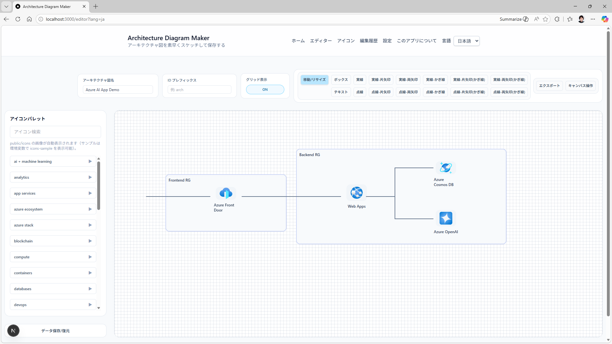

# Architecture Diagram Maker

日本語 | [English](README-en.md)

[](LICENSE)
[](https://nodejs.org/)
[](https://nextjs.org/)
[](https://tailwindcss.com/)

アーキテクチャダイアグラムを素早く作成し、JSON で保存できる軽量エディターです。ローカル保存に加えて Azure Cosmos DB を有効化するとクラウド保存も利用できます。



## 目次

- [主な機能](#主な機能)
- [ドキュメント](#ドキュメント)
- [クイックスタート](#クイックスタート)
- [アイコン配置](#アイコン配置)
- [環境変数](#環境変数)
- [Docker](#docker)
- [Azure Container Apps へのデプロイ概要](#azure-container-apps-へのデプロイ概要)
- [Azure Cosmos DB 連携](#azure-cosmos-db-連携)
- [UI 設定の既定値](#ui-設定の既定値)
- [多言語対応](#多言語対応)
- [Contributing](#contributing)
- [Code of Conduct](#code-of-conduct)
- [ライセンス](#ライセンス)

## 主な機能

- アイコンパレットから配置 (icons フォルダを自動検出)
- サンプルアイコンを環境変数で表示切り替え
- ボックス、テキスト、矢印、ラインの作成
- Z-Order 操作 (前面/背面) と複製・削除
- ローカルストレージへの JSON 保存・読み込み
- PNG / JSON 形式でエクスポート
- アイコン一覧ページで検索・閲覧
- 履歴スナップショットの自動保存と復元
- 設定画面で履歴保持件数と PNG エクスポート倍率を調整

## ドキュメント

- [docs/architecture.md](docs/architecture.md): アーキテクチャ概要
- [docs/architecture-diagram.md](docs/architecture-diagram.md): アーキテクチャダイアグラム
- [docs/technology.md](docs/technology.md): 利用技術の解説
- [docs/features.md](docs/features.md): 実装済み機能一覧
- [docs/operations.md](docs/operations.md): 運用ガイド (詳細)

## クイックスタート

### 前提

- Node.js 20+
- npm

### 手順

1. 環境変数ファイルを作成します。

```
cp .env.template .env
```

2. 依存関係をインストールします。

```
npm install
```

3. 開発サーバーを起動します。

```
npm run dev
```

`http://localhost:3000/editor` でエディターを開けます。

## アイコン配置

- 本番用アイコンは public/icons 配下にフォルダ構造で配置してください。
  - public/icons の中身は .gitignore により Git にコミットされません。
  - フォルダ構造はそのままパレットのフォルダ構造として表示されます。
  - 例: [Azure アーキテクチャセンター](https://learn.microsoft.com/ja-jp/azure/architecture/icons/) から Azure サービスの SVG アイコンをダウンロードし、展開フォルダを icons 配下に置くと利用できます。
- サンプルアイコンは public/icons-sample にあります。
  - パレットに表示するかは ICONS_SAMPLE_ENABLED で制御します。

## 環境変数

- PORT: 既定 3000
- NODE_ENV: development / production
- COSMOS_ENDPOINT: Cosmos DB エンドポイント
- COSMOS_DATABASE: Cosmos DB データベース名
- COSMOS_CONTAINER: Cosmos DB コンテナ名
- NEXT_PUBLIC_HISTORY_LIMIT: 履歴保持件数 (10-1000)
- NEXT_PUBLIC_EXPORT_SCALE: PNG エクスポート倍率 (1-8)
- ICONS_SAMPLE_ENABLED: サンプルアイコン表示切り替え

## Docker

```
docker build -t architecture-diagram-maker .
docker run --rm -p 3000:3000 -e PORT=3000 architecture-diagram-maker
```

ヘルスチェックは /api/health を利用します。

## Azure Container Apps へのデプロイ概要

1. Azure Container Apps 環境と Log Analytics ワークスペースを用意します。
2. コンテナイメージをビルドして Azure Container Registry に push します。
3. Container Apps を作成し、PORT 環境変数を設定します。

最小構成の想定:

- NODE_ENV=production
- ヘルスチェックは /api/health
- Cosmos DB を使う場合はマネージド ID を有効化

## Azure Cosmos DB 連携

/api/diagrams で Azure Cosmos DB への保存・復元に対応しています。環境変数を設定しない場合はローカルストレージにフォールバックします。

### Cosmos DB 設定

以下を設定すると DefaultAzureCredential を利用して Cosmos DB に接続します。事前にデータベースとコンテナを作成しておく必要があります。

- COSMOS_ENDPOINT
- COSMOS_DATABASE
- COSMOS_CONTAINER

コンテナのパーティションキーは /id を前提としています。AAD 認証の場合は RBAC で Cosmos DB Built-in Data Contributor を付与してください。

ローカル開発では az login 済みの Azure CLI 資格情報を利用します。本番は Azure Container Apps のマネージド ID で実行する想定です。

## UI 設定の既定値

- NEXT_PUBLIC_HISTORY_LIMIT: 履歴保持件数の初期値 (10-1000)
- NEXT_PUBLIC_EXPORT_SCALE: PNG エクスポート倍率の初期値 (1-8)

設定画面で変更した値はローカルストレージに保存されます。

## 多言語対応

ヘッダーの言語ドロップダウンから日本語/英語を切り替えできます。URL パラメータ ?lang=ja / ?lang=en で保持します。

## Contributing

Issue の報告や改善提案は歓迎です。変更を提案する場合は、以下の流れを推奨します。

- Issue を作成して背景と目的を共有する
- 小さめの単位で Pull Request を作成する
- 影響範囲が分かる説明とスクリーンショットを添える

## Code of Conduct

すべての参加者に対して敬意を持って接してください。ハラスメントや差別的な行為は許容されません。違反を見かけた場合は Issue で報告してください。

## ライセンス

MIT License. 詳細は [LICENSE](LICENSE) を参照してください。
