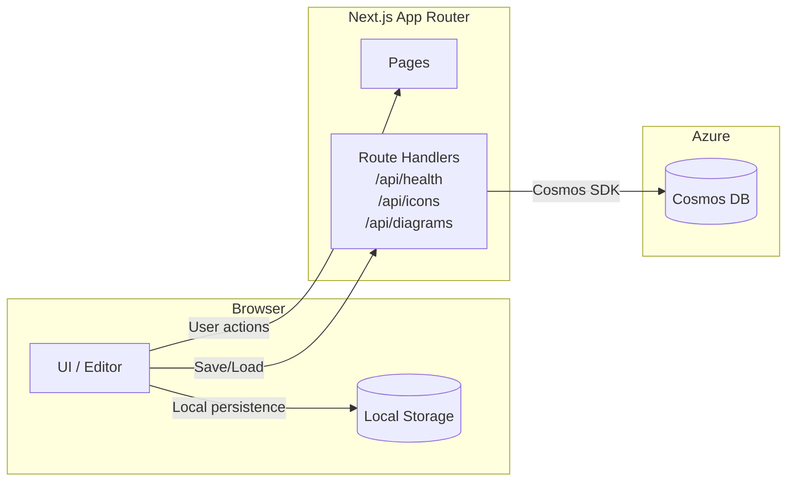

# Architecture Diagram

[日本語](architecture-diagram.md) | English

## Overview

## Notes

- The API uses cloud persistence when Cosmos DB environment variables are configured.
- Otherwise, the client falls back to browser local storage.
