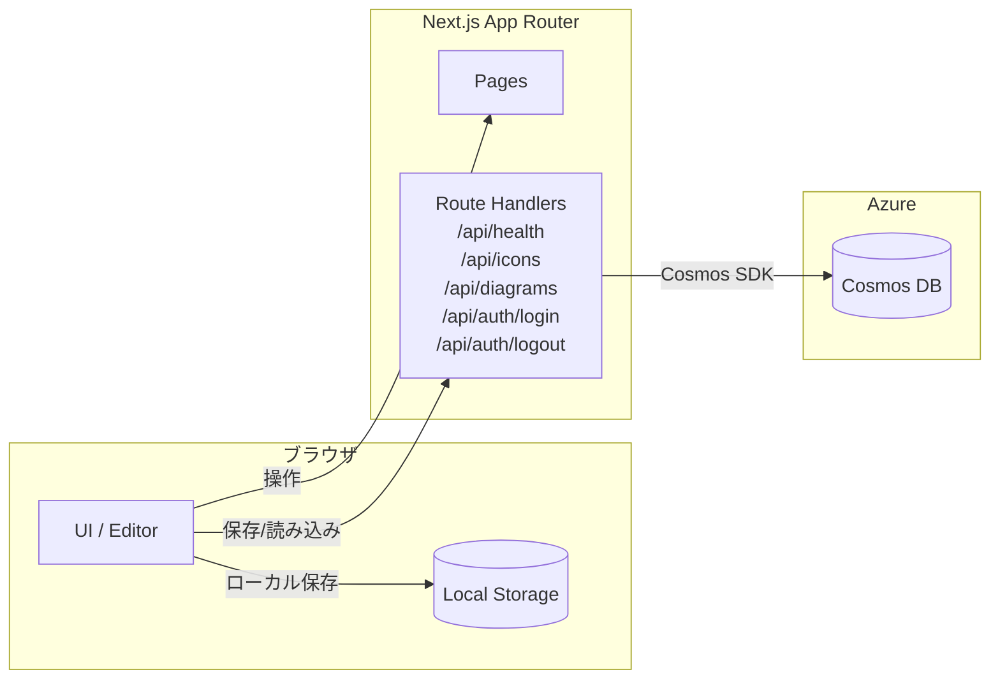

# アーキテクチャダイアグラム

日本語 | [English](architecture-diagram-en.md)

## 全体像

```mermaid
flowchart LR
  subgraph Client[ブラウザ]
    UI[UI / Editor]
    Local[(Local Storage)]
  end

  subgraph App[Next.js App Router]
    Pages[Pages]
    API[Route Handlers\n/api/health\n/api/icons\n/api/diagrams\n/api/auth/login\n/api/auth/logout]
  end

  subgraph Azure[Azure]
    Cosmos[(Cosmos DB)]
  end

  UI -->|操作| Pages
  UI -->|保存/読み込み| API
  UI -->|ローカル保存| Local
  API -->|Cosmos SDK| Cosmos
```

## 補足

- Cosmos DB の環境変数が揃っている場合に API がクラウド保存を使用します。
- 未設定の場合はクライアントがローカルストレージを利用します。
- 履歴スナップショットとドラフトはローカルストレージに保存されます。
